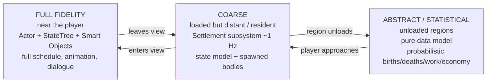
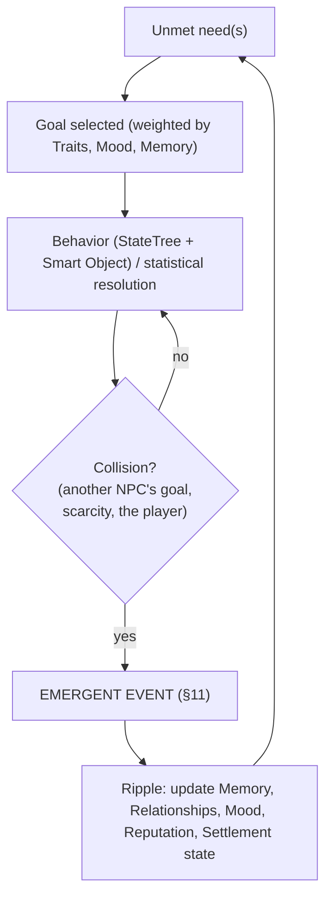
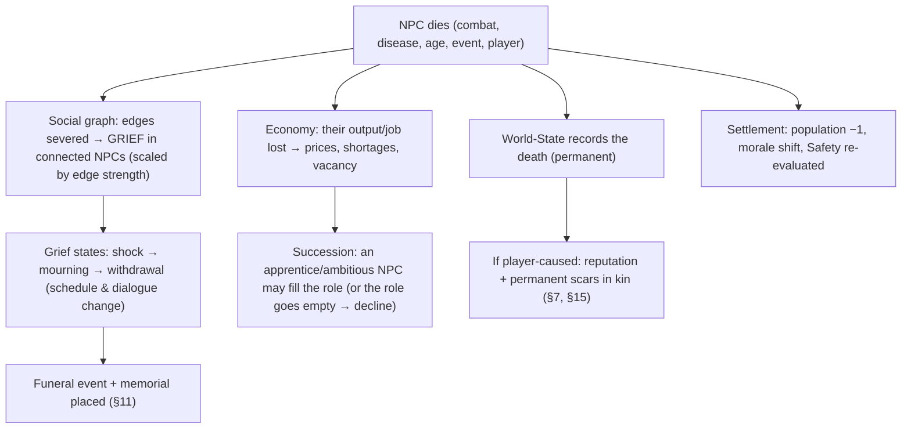

# The Hollow Crown — Living World Design (The World Without You)

> **Status:** Authoritative living-world / NPC-simulation *design* source of truth.
> **Companion:** [`NPCSystem.md`](NPCSystem.md) and [`SettlementSystem.md`](SettlementSystem.md)
> are the implementation contracts (components, subsystems, events); where they differ,
> **this document defines the target**. Built on the simulation services in
> [`../TechnicalArchitecture.md`](../TechnicalArchitecture.md) §2.8–§2.9, §2.15, §2.21–§2.22.
> **Scope:** simulation & narrative *design* only — not code, not authored quest/lore content.

> Tuning numbers are first-pass targets to validate in the simulation gym (one fully
> resident village), per the project's "numbers before code" rule.

---

## 1. Vision — "This world exists even when I am not here."

**The world does not exist for the player. The player exists within the world.** The
Crownless is important, but not the center of existence. NPCs have lives, goals, problems,
families, routines, dreams, fears, and history that began before the player arrived and
continue when the player leaves.

**The five Living-World pillars** (the tie-breakers for every simulation decision):

| # | Pillar | Operational meaning |
|---|--------|---------------------|
| 1 | **Persistence** | Everything that matters is recorded and continues; the world has state, not resets. |
| 2 | **Consequences** | Actions permanently alter the world (routed through World-State, §18). |
| 3 | **Emergence** | Interesting situations arise from the *interaction of simple systems*, not from scripts (§6). |
| 4 | **Attachment** | The player comes to care about specific people and places (§20). |
| 5 | **Memory** | The world — NPCs, settlements, factions, the World-State — remembers and reacts later (§7, §18). |

**The success metric (the long-term goal):** the greatest achievement is *not* defeating a
boss — it is **caring about the world.** The design succeeds if, years later, a player
remembers a *person*, a *place*, a *loss*; if leaving the world feels emotional. Every
system below is judged against that.

---

## 2. Player Experience Goals

The simulation must reliably produce these outcomes:

- The player **remembers NPC names** (because they recur, have routines, and matter).
- The player **cares when an NPC dies** (because attachment was built and grief ripples, §12).
- The player **feels their settlement is home** (because they know who runs the forge, who lost a child, who hates whom, §20).
- The player **creates stories naturally** and meets **unexpected events** (emergence, §6, §11).
- **Every settlement becomes unique** and **every playthrough tells different stories** — because outcomes are the product of specific people + specific events + specific player choices, never a fixed script.

---

## 3. Simulation Fidelity — how the world lives when unwatched

To make *"the world exists when I'm gone"* both **believable and affordable**, the world
simulates at **three fidelity tiers**, and NPCs move between them seamlessly. This is the
honest engineering of every great living world: simulate fully what the player can scrutinize,
and faithfully *abstract* the rest from the same underlying data so it stays consistent.

| Tier | When | What is simulated | Cost |
|------|------|-------------------|------|
| **Full** | Within sight/earshot | The named NPC as an actor: needs, schedule task, Smart-Object use, mood, dialogue, reactions | High — few at a time (significance-gated) |
| **Coarse** | In a loaded settlement, off-screen | The settlement subsystem advances residents' needs, jobs, and events as a **data model**; bodies are spawned/bound only as needed | Low — O(settlement), not O(citizen) |
| **Abstract** | In an unloaded region | The data model advances **statistically** (probabilistic births, deaths, job changes, prosperity, trade) on a slow cadence | Negligible |

**The illusion contract:** an NPC's identity, relationships, memories, and history are the
**same persistent record** at every tier — only the *resolution of behavior* changes. So when
the player returns after a week away, the miller has aged, his apprentice took over a failing
forge, a child was born, and a feud cooled — all *derived from one model*, never faked
inconsistently. The player must never catch the seams: transitions reconcile silently
(promotion/demotion via significance, per the architecture's Mass-vs-actor split).

**Ambient crowd vs. named residents:** truly anonymous background population (a market crowd)
is **Mass entities** (no individual record); anyone the player can *name or know* is a
**resident with a full persistent record**. The line between them is "could the player form a
memory of this person?"

---

## 4. The NPC — Core Framework

Every **resident** NPC (not ambient crowd) carries a persistent record:

| Field | Role in the sim |
|-------|-----------------|
| **Name / Age / Gender** | Identity; age advances over time and gates life-stage (child → worker → elder, §13) |
| **Occupation** | Their role in the settlement economy and schedule (§10) |
| **Personality (traits)** | Biases every decision (§5) |
| **Goals** | Personal drives the sim tries to advance (a dream, a debt, a rivalry to win) |
| **Relationships** | Typed edges to other NPCs (§8) |
| **Skills** | Competence at occupation/combat; affects output and survival |
| **Wealth** | Economic state; drives needs, ambition, theft risk |
| **Health** | Injury/disease/age; can decline to death |
| **Mood** | Short-term emotional state from recent events; colors behavior & dialogue |
| **Fear** | Morale axis (ties to combat §13 Fear); rises under danger/corruption |
| **Loyalty** | To settlement/leader/player; gates recruitment, desertion, betrayal |
| **Faith** | Religious conviction; gates faction affinity and corruption reaction |
| **Settlement** | Home; anchors schedule and belonging |
| **History** | Their personal event log (where they came from, what they've survived) |
| **Reputation** | How others (and the player) regard them; and how they regard the player (§7, §15) |

These fields are not decoration — **every one is an input to a behavior or an event
precondition.** A field that never changes a decision is cut.

---

## 5. Personality / Trait System

Each NPC has a small set of **traits** drawn from opposed pairs, plus a few free traits.
Traits are **decision biases**, not flavor text — they weight the utility of choices in the
NPC's StateTree and set thresholds for events.

Examples (opposed): Brave ↔ Cowardly · Generous ↔ Greedy · Faithful ↔ Skeptical · Patient ↔
Aggressive · Honest ↔ Deceptive · Loyal ↔ Ambitious.

**How traits bias behavior (examples):**
- *Greedy* lowers the threshold to hoard/overcharge and raises theft likelihood when poor.
- *Brave* raises the Fear threshold (stands when others flee, §13); *Cowardly* flees early and may desert.
- *Ambitious* makes an NPC pursue a rival's job/leadership (a source of feuds, §11).
- *Faithful* raises faction affinity to the churches and **sharpens the corruption reaction** (§16).
- *Deceptive* enables lying in dialogue and concealing crimes (suppresses their own memory-spread, §15).

**Trait compatibility** seeds relationships (§8): compatible traits drift toward friendship,
opposed traits toward rivalry. This is a primary engine of emergent social structure.

---

## 6. Needs & the Emergence Engine

Interesting situations are **generated, not scripted.** The engine is: **Needs + Traits +
Relationships + Mood + Memory → a current Goal → a behavior** (executed by the StateTree at
Full tier, or resolved statistically at lower tiers). **Emergent events arise when NPCs'
goals collide** with each other, with scarcity, or with the player.

**Needs** (each decays over time and on events; unmet needs raise drive):

| Need | Satisfied by | When unmet → |
|------|--------------|--------------|
| **Safety** | Shelter, guards, walls, low danger/corruption | Fear, flight, desertion, crime |
| **Food** | Stores, work income, hunting/farming | Hunger → theft, sickness, migration |
| **Rest** | Home, time | Exhaustion → poor work, illness |
| **Social** | Family, friends, the inn, festivals | Loneliness → low mood, leaving |
| **Faith** | Church, rites, a priest | Doubt → faction drift, despair |
| **Purpose** | Pursuing their personal Goal | Frustration → ambition, conflict |

**The designer's job is not to write events but to tune the *pressures*** — scarcity levels,
trait distributions, need decay — so that the *right density* of interesting collisions
occurs. Too few = lifeless; too many = chaos. The simulation gym (one village) is where this
is balanced.

---

## 7. Memory System

Every resident, settlement, faction, and the World-State keeps a **bounded, decaying,
salience-weighted memory** of events. Memory is what makes the world *feel* like it knows you.

- **An entry** = `{event, actors, emotional valence (−/+), salience, timestamp}`.
- **Salience** decides retention: trivia fades in days; significant events (you saved the
  village, you robbed me) persist for a long time; **scars are permanent** (you killed my
  child; you razed my home; I watched you turn monstrous).
- **Decay** is salience-scaled; low-salience memories blur and drop, keeping the model bounded
  and *human* (NPCs forget the small, remember the searing).
- **Valence** colors future interaction: a positive memory warms disposition and dialogue; a
  negative one cools or closes it.
- **Memory feeds reputation** (§15) and **disposition** (toward the player *and* toward other
  NPCs — an NPC remembers who wronged their kin).

**The player must feel remembered:** an NPC you saved greets you differently a season later; a
village you failed is cold; a relative of someone you killed will never deal with you. Memory
is the mechanical substrate of Pillar 5.

---

## 8. Relationship System

NPCs are nodes in a **social graph** of typed, weighted edges that **form and evolve**:

| Edge | Seeded / formed by |
|------|--------------------|
| **Family** | Authored/birth seeding; strongest grief edges (§12) |
| **Friendship** | Proximity + shared positive events + compatible traits |
| **Rivalry** | Competition for job/status/mate + opposed traits |
| **Mentorship** | Skill gap + occupation + time (apprentice → successor, §13) |
| **Romance** | Compatibility + proximity + status; can form families over time |
| **Alliance / Conflict** | Faction alignment, settlement politics, shared/clashing goals |

Edges have **strength** that rises and falls with shared experience (a saved life, a betrayal,
a death witnessed together). The graph is **the thing that makes death hurt** — grief and
consequence propagate along edges (§12) — and the engine of social emergence (feuds,
factions-within-villages, successions). Relationships evolve naturally; the player can perturb
the graph (befriend, divide, avenge) but does not script it.

---

## 9. Daily Life & Schedules

Schedules are **needs-driven**, not fixed timetables — believability comes from NPCs doing the
*sensible* thing for *their* state, anchored to **Smart Objects** (a specific bed, workbench,
pew, stool at the inn).

A believable day interleaves: **Sleep · Food · Work · Travel · Socialization · Rest ·
Religious activity · Emergency reactions.** Rules:

- The **schedule template** (from the NPC profile) sets the rhythm; **current needs and events
  override it** (a hungry NPC eats early; a frightened one shelters; a grieving one withdraws).
- NPCs **claim Smart Objects** (one user at a time) so two people don't occupy one bed; queuing
  and contention are themselves social moments.
- **Emergency reactions** pre-empt everything: fire, raid, a body in the street, a Blood Moon —
  the schedule yields to safety (ties to §13 Fear and the Weather system).
- Schedules **read at every fidelity tier**: full animation up close, abstract "is at work / is
  asleep" when distant — same intent, different resolution.

The test: a player who watches one NPC for a day should be able to *predict and explain* their
movements — and be surprised only when something real happened.

---

## 10. Occupations

Occupations are **simulation roles**, each with a schedule, workplace(s) (Smart Objects),
tools, behaviors, goals, and an **economic function** (a source or sink in the settlement
ledger, per the Economy framework).

| Occupation | Workplace | Economic role | Signature goal |
|------------|-----------|---------------|----------------|
| **Blacksmith** | Forge | Converts ore → tools/arms; repairs | Master the craft / pay off the forge |
| **Hunter** | Wilds, lodge | Brings meat/pelts; early-warning of threats | Bag the great beast / feed the family |
| **Guard** | Walls, gate | Security (raises Safety; defends in raids) | Protect / rise to captain |
| **Farmer** | Fields | Food production (prosperity backbone) | A good harvest / more land |
| **Merchant** | Market, road | Trade (links settlements, §13 routes) | Profit / a trade empire |
| **Priest** | Church | Faith need; rites, funerals, morale | Save souls / hold faith against corruption |
| **Scholar** | Library | Lore, research, unlocks | Recover lost knowledge |
| **Builder** | Sites | Raises/repairs buildings | Rebuild the settlement |
| **Innkeeper** | Inn | Social hub; news/rumor spread (§15) | Keep a lively house |
| **Fisherman** | Water | Food (coastal/river) | The big catch / a safe boat |
| **Messenger** | Roads | **Carries memory/reputation between settlements** (§15) | Deliver / survive the road |

Jobs are **filled by people, and re-filled on death** (succession, §12). An empty critical
role (no smith, no farmer) is a settlement *problem* that drives migration, recruitment need,
and decline.

---

## 11. Emergent Events

Events are **generated from state**, then *dramatized* if the player is present (or resolved
abstractly if not). The model is uniform:

> **Precondition** (a configuration of world/NPC/settlement state) → **Resolution** (the event
> plays out, changing state) → **Ripple** (memory, relationships, mood, reputation, economy
> update — feeding §6).

**Event catalogue (state-seeded, not scripted):**

| Event | Typical precondition |
|-------|----------------------|
| **Argument** | Two NPCs, opposed traits + a contested resource/relationship |
| **Theft** | Poor + *Deceptive/Greedy* NPC, unmet Food/Safety, weak guard |
| **Fire** | Hazard + weather (wind/storm) + dense timber; or arson from a feud |
| **Animal attack** | Wildlife pressure + weak defense + isolation |
| **Disease outbreak** | Low sanitation/crowding + a sick traveler arriving |
| **Religious ceremony** | Calendar + a priest + sufficient Faith |
| **Funeral** | A death (§12) |
| **Festival** | High prosperity + season + morale |
| **Raid** | Bandit/faction strength + a prosperous, weakly-defended target |
| **Travelers arriving / Merchant visiting** | An existing road/route + safety + reputation |

Designers tune **preconditions and rates**, not instances. The *same* event type produces
different stories because the *participants* and *ripples* differ every time — a fire that
kills the only smith is a different story from one that merely costs a barn.

---

## 12. Permanent Death & Grief

**Most NPCs can die — and death matters.** Death is not a despawn; it is a **state change that
ripples through every connected system.**

- **Grief is proportional and visible:** a spouse withdraws and may never fully recover; a
  rival feels little; the settlement's mood dips. Grief is expressed through **changed
  schedules, dialogue, and mood**, not a number the player never sees.
- **The world acknowledges loss:** funerals occur, **memorials appear**, workers are missed,
  the economy feels the gap. Silence after a death is itself a statement.
- **Succession & decline:** death creates *opportunity and risk* — an apprentice rises (a
  hopeful story), or a critical role goes empty and the settlement slides toward collapse (a
  tragic one). Both are valid emergent outcomes.
- **Player-caused death is heaviest:** kin remember it permanently (§7); it scars reputation
  (§15); witnesses spread it — unless there were none (a dark, deliberate systemic truth: the
  dead don't gossip, §15).

Death only *hurts* if attachment was built first (§20) — so the systems that make you *know*
people are prerequisites for the systems that make you *mourn* them.

---

## 13. Settlement Life & Evolution

Settlements are **living organisms** that change with or without the player (Coarse/Abstract
tiers, §3):

- **Population dynamics:** births (from families), **children age into workers** over real
  in-game time, deaths, and **migration** in/out driven by prosperity, Safety, and the
  **player's reputation** (a renowned protector draws settlers; a feared monster empties a
  town).
- **Jobs & succession:** roles are assigned by skill/relationship; vacancies (death, growth)
  are filled or felt (§10, §12).
- **Buildings:** appear (Builder + resources), are maintained, or **decay** when neglected/
  understaffed — the physical face of prosperity.
- **Trade routes emerge** between prosperous, connected, safe settlements (Merchants/
  Messengers traverse them, carrying goods *and* reputation, §15); routes can be cut by raids
  or a feared player.
- **Prosperity loops with a comeback path:** prosperity feeds growth feeds prosperity
  (positive loop), but scarcity/death/raids/high-corruption push decline. **A negative
  feedback floor and recovery mechanic exist** (a struggling settlement can be saved) so
  decline is dramatic, not a death spiral the player can't reverse — the same "comeback must be
  possible" principle as combat balance.
- **Uniqueness is emergent:** no two settlements end the same because each is the sum of its
  specific residents, its event history, and the player's specific choices. The data produces
  the personality; designers seed starting conditions, not outcomes.

---

## 14. Settlement Management & Recruitment

The player builds a settlement by **recruiting survivors — people, never generic citizens.**

- **Every recruit is an individual** with strengths, weaknesses, traits, skills, a **history**,
  and existing **relationships** (recruiting one may bring their kin — or their rival).
- **Recruitment is a decision with consequences:** a skilled but *Ambitious/Deceptive* smith
  may feud or steal; a *Cowardly* guard breaks in a raid; a beloved healer raises everyone's
  mood. The player weighs competence against character.
- **Recruits bring their own goals and problems** into your settlement, *seeding new
  emergence* (§6, §11). The settlement is not a resource tally; it is a **cast** the player
  assembles, and the stories follow from who they chose.
- **Loyalty matters:** mistreatment, fear, unmet needs, or the player's corruption can drive
  desertion or betrayal; trust and protection build loyalty that holds the settlement together
  under pressure.

---

## 15. Reputation System

Reputation is **multi-layered**, derived from aggregated **memories (§7) and World-State facts
(§18)**, and it **propagates** through the world rather than being a single global number.

| Layer | Held by | Driven by |
|-------|---------|-----------|
| **Individual** | Each NPC | Their personal memories of you |
| **Settlement** | A settlement | Aggregate of resident memories + local deeds |
| **Regional** | A region | Major deeds, propagated over time |
| **Faction** | Each faction (§17) | Acts aligned with/against the faction's goals |
| **Religious** | The churches | Faith-relevant acts + corruption |
| **Corruption** | A special axis | The player's corruption stage (§16) |

**Propagation rules (the part that makes it feel real):**
- **Word travels at the speed of people.** A deed is known locally at once; it reaches the
  region as **Messengers, merchants, and travelers carry it** along routes (§10, §13). Cut the
  roads and news slows.
- **Witnesses matter.** Reputation change requires someone to *see and survive* to tell it. A
  crime with no living witnesses barely spreads — **the dead don't gossip.** This makes
  silencing witnesses a coherent (and chilling) systemic option, not a hack.
- **Reputation decays slowly** but **scars persist** (§7): heroism fades to legend; atrocity
  becomes a name mothers use to frighten children.
- **Different groups react differently** to the *same* act — saving a village endears you to
  its people and the Church, but a faction that wanted it gone now opposes you.

---

## 16. Corruption Reactions (a central system)

Corruption (the player's signature meta-progression) is a **special reputation axis** that the
whole social world reads. As the player's corruption **stage** rises (the stage tag from the
Corruption framework):

- **Fear rises and Trust falls** broadly — NPC Fear thresholds drop near you; the *Faithful*
  and *Cowardly* react first and hardest; some flee, refuse trade, or bar their doors.
- **Factions split:** the **Crown-Touched Cult** grows *friendlier* (you are becoming what they
  worship); the **Church of the Last Dawn** and **Silent Clergy** turn *hostile*. Corruption
  **inverts** relationships that other reputation can't.
- **Dialogue changes** — corruption-gated lines open (others recoil); some NPCs speak to you as
  a portent.
- **Relationships & romance shift:** bonds strain or break; some romances become impossible,
  others (the devoted, the corrupt) become *possible only now*.
- **Trade & settlement dynamics change:** prices rise (fear tax), recruitment slows, your own
  settlement's loyalty is tested — a corrupt lord rules through dread, not love.

Corruption thus turns the living world into a **mirror of the player's choices**: power bought
with belonging. It is independent (a clean axis) but **read by every social system**, exactly
as the Corruption framework prescribes.

---

## 17. Faction System

Factions are **higher-order agents** with their own goals, politics, and influence, simulated
above the individual. Each has: **goals · enemies · allies · resources · beliefs · politics ·
influence**, and a **regional influence** value that rises and falls.

Examples (structure, not lore): *Church of the Last Dawn · The Blackwood Hunters · Ashbourne
Nobility · Drowned Brotherhood · Silent Clergy · Crown-Touched Cult.*

- **Factions pursue goals** (expand influence, control a region, suppress a rival, spread/resist
  corruption) — generating faction-level emergent events (raids, ceremonies, power struggles,
  pilgrimages) that flow down into settlements and encounters.
- **They react to the World-State and the player:** a faction whose enemy boss you killed gains
  ground; one whose interests you crossed moves against you; corruption realigns them (§16).
- **Faction reputation gates** membership, services, safe passage, and hostility; standing with
  one often *costs* standing with its enemies (no universal goodwill).
- **Politics between factions** (alliances, betrayals, territorial pressure) means the regional
  map of power **shifts over a playthrough**, and the player is one force among several — not
  the only mover.

---

## 18. World Memory System

The **World-State subsystem** (architecture §2.15) is the world's permanent ledger and the
backbone of Pillars 1, 2, and 5. It records the facts that outlive any individual: **boss
deaths, village destruction, settlement growth, faction victories, player crimes, player
heroism, player corruption, world events.**

- **The world reacts later, sometimes years later:** a village you saved shelters you a season
  on; a massacre is a regional scar that precedes you into every town; a boss's death has
  visibly changed its region; a faction you empowered now dominates.
- **It is the spine the Save system serializes** (architecture §8) — so persistence is real
  across sessions, not session-local.
- **Everything routes through it:** if it "permanently changed the world," it is a World-State
  fact, broadcast so settlements, factions, reputation, and encounters can react. Nothing polls;
  everyone subscribes.

---

## 19. Random & World Encounters

Encounters are **story-shaped and state-seeded**, never noise. An **Encounter Director** weighs
candidate encounters by nearby **World-State, reputation, faction influence, region, weather,
and time**, so what you meet *makes sense for where and who you are*.

| Encounter | Seeded by |
|-----------|-----------|
| **Lost child** | A nearby raid/death/displacement event |
| **Wounded hunter** | Blackwood Hunters presence + wildlife/boss danger |
| **Traveling priest / Pilgrimage** | Church influence + a religious event + a route |
| **Escaping prisoner** | A faction conflict / a nearby holdfast |
| **Bandit ambush** | Bandit strength + your wealth/weakness + a lonely road |
| **Funeral procession** | A recent death in a connected settlement (§12) |
| **Merchant caravan** | An established trade route (§13) + safety |

Every encounter **carries a thread of the simulation** (the caravan is going *somewhere real*;
the funeral is for *someone who died*) and **its outcome ripples back** (you saved the child →
a family remembers; you robbed the caravan → a route dies and your reputation darkens).
Encounters are where the off-screen simulation *becomes visible* to the player.

---

## 20. Settlement Attachment Loop

Attachment (Pillar 4) is **engineered**, because mourning (§12) and consequence are hollow
without it. The loop that makes a settlement *home*:

1. **Recurrence** — the same named NPCs, in the same roles, on legible routines (§9), so faces
   become known.
2. **Specificity** — each has a name, a history, a relationship, a problem the player can learn
   (who runs the forge, who owns the inn, **who lost a child**, who hates whom, who became
   leader).
3. **Reciprocity** — NPCs **remember and react** to the player (§7); the relationship is
   two-way.
4. **Investment** — the player *recruited* these people and *built* this place (§14), so its
   fate is their fate.
5. **Stakes** — anyone can die (§12), permanently; the settlement can prosper or collapse
   (§13). Safety is never guaranteed.

When all five hold, the player **knows** the settlement — and therefore *cares*. That caring is
the entire point.

---

## 21. Emergent Storytelling — how it all combines

No single system tells a story; **stories are what the player perceives when the systems
interact over time.** A worked illustration (every element below is a system, not a script):

> A *Greedy* smith (§5) overcharges during a food shortage (§6 needs, §13 economy). A poor
> hunter, his *rival* (§8), steals from him (§11 theft). The smith demands justice; the player
> chooses a side — and is *remembered* for it (§7). The hunter, humiliated, leaves for the
> Blackwood Hunters (§17). A raid comes (§11); without the hunter's early warning, a guard dies
> (§12); his widow withdraws into grief, a memorial appears, and the settlement's morale and
> Safety fall (§13). News of the player's judgment — and the death — spreads down the road
> (§15). Seasons later, the player returns to a quieter town that remembers (§18).

The designer authored **none** of that — only the people, the pressures, and the rules.
**Different participants and choices produce a different story every time**, which is why every
playthrough and every settlement is unique.

---

## 22. Fidelity, Honesty & Phasing

This is among the most ambitious designs in the genre; shipping it requires discipline about
*what is truly simulated vs. believably abstracted*, and a phased build.

- **The honesty rule:** simulate fully what the player can scrutinize; abstract the rest from
  the *same data* so it's consistent (§3). We do **not** promise every NPC in the world is
  fully simulated at all times — we promise the world is *consistent and persistent*, which is
  what the player actually feels.
- **Bounded models:** memory decays and is capped (§7); ambient crowds are not residents (§3);
  the social graph is local-dense, region-sparse. Unbounded growth is the enemy of a shippable
  living world.
- **Phasing (maps to the roadmap):**
  - *Slice:* **one settlement, fully alive** — a small named cast with needs, schedules,
    relationships, memory, death/grief, a handful of emergent event types, and reputation that
    matters locally. Prove the loop produces attachment and stories before scaling.
  - *Then:* multiple settlements + migration + trade routes + regional reputation propagation.
  - *Then:* full faction simulation, abstract regional simulation, and the long-tail world
    memory reactions.
- **The risk to watch:** emergence density tuning (§6) — a lifeless or a chaotic village both
  fail. This is found by playtesting the gym, one change at a time, not by spec.

---

## 23. Design Guardrails (what this must never become)

- **No static NPCs.** If a character never changes state, has no needs, and forms no memory,
  it is ambient crowd or it is cut.
- **No quest dispensers.** NPCs have lives and goals; "quests" emerge from their problems and
  the world's state, not from exclamation marks attached to inert givers.
- **No decorative characters.** Anyone the player can name is a resident with a record; anyone
  who can't be named is honest crowd, not a fake person.
- **The player is not the center.** NPCs pursue *their* goals whether or not the player is
  watching; the world's events do not wait for an audience.
- **Death is permanent and it costs something** — economically, socially, emotionally. A death
  the world doesn't notice is a failure.
- **The world remembers.** Consequences persist through the World-State; nothing important
  resets.
- **Attachment before tragedy.** Systems that make the player *know* people are prerequisites
  for systems that make them *grieve* — build, and tune, in that order.

> The boss is the thing the player conquers. The world is the thing the player *loses* when
> they put the game down — and remembers years later. That loss is the design's true target.
