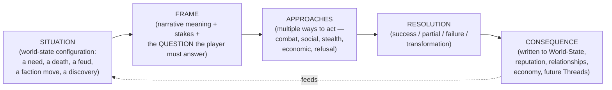
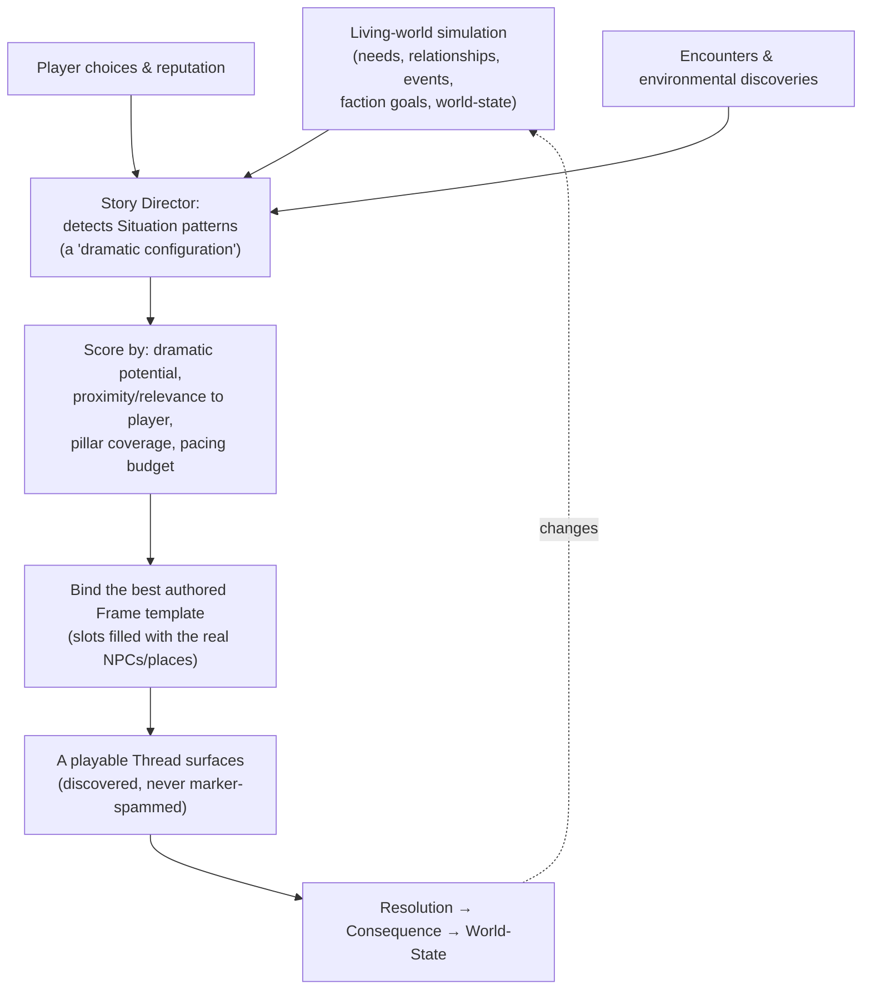
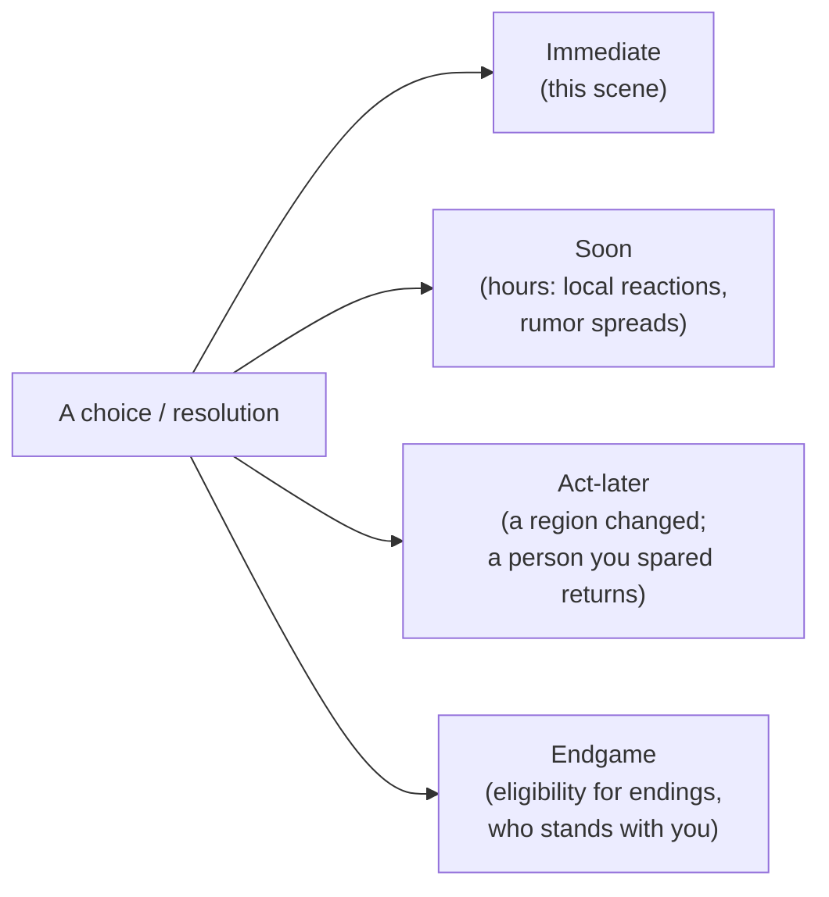

# The Hollow Crown — Quest & Narrative Design (Problems, Not Tasks)

> **Status:** Authoritative quest-philosophy & narrative-framework *design* source of truth.
> **Builds on:** [`LivingWorld.md`](LivingWorld.md) (the simulation that *produces* the
> problems), the **World-State**, **Faction**, **Reputation**, **Corruption**, and **Boss**
> frameworks in [`../TechnicalArchitecture.md`](../TechnicalArchitecture.md) (§2.12 Quest,
> §2.15 World-State, §2.11 Boss, §2.16 Corruption, §2.21–§2.22 Factions).
> **Companion contracts:** [`CorruptionSystem.md`](CorruptionSystem.md), [`NPCSystem.md`](NPCSystem.md).
> **Scope:** the *framework and philosophy* — **not** authored quests, scripts, or lore.

---

## 1. Vision — "Players solve problems; they do not complete tasks."

A quest in The Hollow Crown is **a real event happening in the world that the player chooses
to involve themselves in** — not a chore handed out by a marker. The world has problems
because it is *alive* (`LivingWorld.md`); the narrative layer **frames those problems with
meaning, offers the player ways to act, and writes the outcome permanently back into the
world.**

**The one rule that gates everything: every quest must pose a *question*, not assign a
*task*.** "Kill the wolves" is a task. "The hunter's son went into the Blackwood three days
ago and the pack has come down to the village — is one missing child worth the hunters you'll
lose looking?" is a question. If a piece of content cannot be phrased as a question the player
will *answer with a choice*, it is not a quest and is cut.

**Vocabulary (used precisely throughout):**

| Term | Meaning |
|------|---------|
| **Situation** | A dramatic configuration of world state (from the simulation or authored) — the raw problem. |
| **Thread** | A *framed, playable* story arising from a Situation — what the player perceives as "a quest." |
| **Beat** | A stage within a Thread. |
| **Approach** | A distinct way the player can pursue a Beat/Thread (not a branch we wrote — a space we allow). |
| **Resolution** | How a Thread ends (success, partial, failure, or transformation). |
| **Consequence** | The permanent change a Resolution writes to the World-State and the living world. |

We avoid the word "quest" in fiction and UI where possible — the player has *problems to
solve* and *threads to follow*, never a checklist.

---

## 2. The Seven Quest Pillars

Every Thread is judged against these; a Thread that serves none is filler and is cut.

| Pillar | The Thread must… |
|--------|------------------|
| **Mystery** | Withhold something the player wants to know; reward curiosity. |
| **Discovery** | Be *found*, not assigned by a marker; understanding is part of the reward. |
| **Choice** | Force a real decision with no dominant option (§8). |
| **Consequence** | Change the world permanently (§9). |
| **Emotion** | Target a specific feeling and earn it (§20). |
| **World Impact** | Leave a visible mark others react to (§10). |
| **Replayability** | Be capable of going meaningfully differently (§21). |

---

## 3. The Quest Model — the unit of story

Every Thread, handcrafted or emergent, has the same five-part shape. Authoring *anything* —
a settlement problem, a companion arc, a boss questline — means filling this shape.



- **Situation** is supplied by the simulation (emergent) or by authoring (handcrafted spine).
- **Frame** is *always* handcrafted writing — this is where meaning, voice, and the *question*
  live, and it is why our content never "feels generated."
- **Approaches** are a *space the design allows*, not a menu we wrote: the systemic game (combat,
  social, stealth, economy, and the right to *walk away*) provides the verbs; good Threads make
  several of them viable.
- **Resolution** includes **failure and transformation** as first-class outcomes (§18).
- **Consequence** is mandatory and permanent — a Thread with no consequence is decoration.

---

## 4. Three Sources of Threads (and the anti-"feels generated" doctrine)

| Source | What it is | Used for |
|--------|-----------|----------|
| **Handcrafted** | Fully authored Situation + Frame + Beats | The main spine, boss questlines, companion arcs, mysteries |
| **Emergent** | Situation from the live simulation, **Frame from a curated authored template** | Settlement/faction problems, random story situations (§19) |
| **Hybrid** | Authored Frame/Beats **seeded** by emergent participants and timing | Most Threads — the default |

**The doctrine that prevents "feels generated":** we **never procedurally generate writing or
meaning.** The simulation only ever supplies *who, where, and when* (real NPCs with real
histories, a real place, a real triggering event). The **Frame — the words, the stakes, the
question, the emotional shape — is always handcrafted**, drawn from a curated library of
authored templates with slots. A "missing villager" Situation is real (an NPC's Safety need
collapsed off-screen, §`LivingWorld`§11); the *story* of finding them is written by a human.
This hybrid is the only honest path: pure-procedural quests feel hollow (the brief forbids
this), pure-authored quests can't populate a living world. **Author the meaning; let the world
supply the matter.**

---

## 5. Emergent Quest Framework

Threads emerge by a **Story Director** that watches the living-world simulation for *dramatic
configurations* and frames the strongest ones. It sits directly on top of the
`LivingWorld.md` emergence engine and the World-State.



**Situations emerge from** (the brief's sources, each mapped to a sim signal): NPC
relationships (a feud crossing a threshold), world events (a fire, a raid), settlement needs (a
shortage, §11), faction conflicts (a faction goal advancing, §12), player choices (a prior
Consequence), random encounters (§19), and **environmental discoveries** (the player finding a
mass grave, a shrine, a body — exploration *is* a Situation source, honoring Pillar 1's
no-handholding exploration).

**Pacing budget:** the Director throttles how many Threads surface near the player at once, so
the world feels *full of life* but never *spammy with quests* — emergence density tuned in the
gym (`LivingWorld.md`§22).

---

## 6. No Generic Quests — the transformation pattern

The forbidden structures (kill N, collect N, escort, fetch, deliver) are banned *as
objectives* but are perfectly good *actions* once wrapped in the Quest Model (§3). The
**transformation pattern**: take the mechanical verb, add **a problem, stakes, a question,
multiple approaches, and a consequence.**

| Forbidden as a task | Transformed into a Thread |
|---------------------|---------------------------|
| **Kill 10 wolves** | A starving winter pack is taking children; the hunters want them exterminated, the old woman says they're Crown-touched and killing them spreads it. *Cull, drive off, or investigate the source?* — each with different costs and a different settlement future. |
| **Collect 15 herbs** | A disease is in the settlement; the cure needs a flower that grows only in a place someone died protecting. *Risk the place, ration the cure (who lives?), or seek a faction's costly help?* |
| **Escort the NPC** | A witness to a faction's crime must reach safety; the faction is hunting them and *the witness is lying about something.* The journey is a moving moral problem, not a babysitting timer. |
| **Fetch the object** | The object is a relic two families both claim as their dead son's; retrieving it forces you to decide *whose grief is honored.* |
| **Deliver the letter** | The letter, if read, reveals a betrayal that will get someone killed. *Deliver it sealed, read it, alter it, or destroy it?* Delivery becomes a choice about complicity. |

The rule: **the verb is never the point; the question is.** If a Thread's one-line pitch is its
verb ("kill the wolves"), it has failed; if it's a question ("is one child worth the pack?"),
it passes.

---

## 7. The Eight Thread Types

Each type is a *lens* on the Quest Model, with its own Situation sources and stakes.

| Type | Situation source | Characteristic stakes | Notes |
|------|------------------|-----------------------|-------|
| **Personal** | A single NPC's goal/problem/secret | One person's life, dignity, or fate | The smallest, most intimate; where attachment (§`LivingWorld`§20) pays off |
| **Settlement** | A settlement need crossing a threshold (§11) | The home's prosperity/survival | Mostly emergent; the player's stake is their own town |
| **Faction** | A faction pursuing a goal (§12) | Regional power balance; your standing | Often mutually exclusive — helping one costs another |
| **Regional** | Aggregated regional state / a region's defining wound | A whole region's condition | Multi-stage; resolves an act |
| **World** | The World-State spine (the Crown, the corruption) | The fate of the kingdom and the ending | Handcrafted; the through-line |
| **Boss** | A fallen legend's tragedy (§15) | Understanding + a tragic confrontation | Pre-fight arc that makes the kill *cost* something |
| **Companion** | A travelling companion's arc (§13) | A person you travel with — who can die | Deepest character writing; reacts to your corruption |
| **Corruption** | The player's corruption stage (§14) | What you are becoming; who accepts it | Content gated by, and reactive to, corruption |

---

## 8. Choice Design

Every important Thread contains **meaningful choices**, and the bar is strict.

**The choice rubric — a major choice must satisfy all of these:**
1. **No dominant option.** Every path has real advantages *and* disadvantages.
2. **Trades values, not just numbers.** Mercy vs. safety, loyalty vs. truth, the few vs. the
   many, the present vs. the future — the player chooses *what they value*, not "good vs. evil."
3. **Costs something real.** Resources, a relationship, a reputation, a person, a future option.
4. **Is made under incomplete information.** The player rarely knows the full consequence in
   advance (mirrors a world that doesn't telegraph outcomes; honors Mystery).
5. **Resonates later** (§9 latency) — the choice is *recontextualized* by a future reveal, so
   the player re-judges what they did.
6. **Is expressed through action where possible.** Per the architecture's delivery hierarchy
   (*did it > saw it > heard it > read it*), the strongest choices are *enacted in the world*,
   not picked from a wheel.

**No obvious good option. No obvious evil option.** The design explicitly rejects morality
meters and "paragon/renegade" framing. The player should leave a major choice *uncertain they
were right* — and able to defend it. The intended post-choice feeling is **"I think I did the
right thing… didn't I?"**

---

## 9. Consequence System

Consequences are **persistent and routed through the World-State** (the one authoritative
ledger, architecture §2.15 / `LivingWorld.md`§18). A Resolution writes some mix of: world-state
flags, reputation deltas (multi-layer), relationship/graph changes, economic shifts, faction
influence, NPC survival/death, unlocked or foreclosed future Threads, altered boss encounters,
and ending eligibility.

**Consequences may affect:** NPC survival · settlements · economy · faction power · trade ·
world state · future Threads · boss encounters · endings.

**The latency model (a first-class design tool):** consequences land on different horizons, and
*delay is deliberate* — the further a consequence echoes, the more it makes the world feel like
it remembers.



**Rules:** every major Resolution schedules at least one **delayed** consequence (so choices
have a tail); consequences are **never silently reversed** (Pillar: the world remembers);
consequences are **shown, not stated** wherever possible (a missing face at the forge, a cold
greeting, a memorial — `LivingWorld.md`§12). The player learns, over a playthrough, that the
world is keeping accounts.

---

## 10. Quest Memory

Quest outcomes are remembered at every level of the living world, using the existing memory and
reputation systems (`LivingWorld.md`§7, §15) — quests don't need a separate memory system; they
*write into* the world's:

- **NPCs remember** outcomes that touched them (you saved their child; you let their brother
  hang) — permanently if it's a scar.
- **Settlements remember** (you broke the siege; you sided with the thief over the smith).
- **Factions remember** (you ran their errand; you crossed them) — affecting standing and future
  Faction Threads.
- **The World-State remembers** the spine-level outcomes (a boss dead, a region saved or razed).

And these memories **surface across time** (§9 latency): hours later (rumor), days later (a
changed greeting), **acts later** (a spared enemy returns; a saved village shelters you), and at
the **endgame** (who stands beside you, which endings are open).

---

## 11. Settlement Threads

Settlement Threads are **mostly emergent**, surfacing when a settlement's simulated state
crosses a dramatic threshold. Each maps a `LivingWorld.md` sim signal to a framed question:

| Settlement Situation | The question it frames |
|----------------------|------------------------|
| **Food / resource shortage** | Who goes hungry — and what will the desperate do? |
| **Disease** | Who gets the scarce cure; do you risk spreading it; quarantine the sick? |
| **Crime** | Justice or mercy; the law or the cause behind the crime? |
| **Politics / leadership** | Who should lead — the strong, the kind, the rightful, *you*? |
| **Family disputes** | Whose grief or grievance is honored? |
| **Religious conflict** | Faith vs. doubt; orthodoxy vs. the corrupted truth? |
| **Defense need** | Stand and risk the people, or yield the place? |
| **Migration** | Take in refugees (who they are matters) or turn them away? |
| **Economic problems** | Whose livelihood is sacrificed to save the settlement? |

Because the *participants are real residents the player knows*, these Threads are where
attachment becomes drama — and where a player's own settlement (§`LivingWorld`§14) generates its
most personal stories.

---

## 12. Faction Threads

Faction Threads arise from **faction goals advancing** (`LivingWorld.md`§17); the factions, their
beliefs, secrets, and political web are the [**Faction Bible**](../FactionBible.md). Structures:

- **Alliances** — earn a faction's trust through aligned action; alliance grants resources/
  passage but *binds* you (their enemies become yours).
- **Betrayals** — the option (yours or theirs) to break an alliance; high payoff, lasting scar.
- **Espionage** — gather/plant information; outcomes shift influence quietly rather than by force.
- **Religious conflicts** — doctrine and corruption pit churches against cults; faith is a side.
- **Territory disputes** — back a claim; the regional map of influence shifts (and remembers).
- **Political struggles / leadership conflicts** — install or topple a faction leader; you change
  *who* the faction is and thus its future goals.

**Mutual exclusivity is the point:** factions have enemies, so faction Threads are a primary
source of **replayability** (§21) — a run that serves the Church is a different game from one
that serves the Cult, and corruption (§14) tilts which doors are even open.

---

## 13. Companion Threads

Companions are **a special class of resident** — a full `LivingWorld` record *plus* a handcrafted
arc. They must feel human:

- **Personal goals, internal conflicts, secrets, relationships, and failures** — authored, but
  revealed through travel and trust, not info-dumped.
- **Growth arcs in Beats gated by trust + world state:** a companion's arc advances as your
  relationship deepens *and* as the world turns (a companion from a region you let fall reacts to
  that).
- **They react to the player** — to your choices, your reputation, and especially **your
  corruption** (§14): a companion may follow you into darkness, try to save you, leave, or turn on
  you, by their traits and your stage.
- **Potential death is real** — companions can die (in their arc, in a Thread's failure, in
  combat), permanently, with full grief ripple (`LivingWorld.md`§12). A companion's death should be
  among the game's heaviest losses *because* attachment was built first.
- **Failure within a companion arc** (you didn't earn trust in time; you chose against them)
  branches the arc rather than ending it — including toward estrangement or tragedy.

---

## 14. Corruption Threads

Corruption (the signature axis) generates **unique questlines** and **re-skins existing ones**.
The world's stances toward corruption are diverse — some NPCs/factions **fear** it, some
**worship** it, some **exploit** it, some **study** it — and each stance is a Thread source:

- **Feared:** Threads about hiding, being hunted, or terrifying people into compliance.
- **Worshipped:** the Crown-Touched Cult opens Threads *only* to the corrupted (`LivingWorld`§16).
- **Exploited:** opportunists who want to *use* your power — alliances of convenience with a price.
- **Studied:** scholars/clergy who want to understand or cure you — knowledge Threads with moral cost.

**Outcomes change with corruption stage:** the *same* Thread can resolve differently by your stage
(an NPC who would beg a human player flees a monstrous one; a door shut to the pure opens to the
corrupt). Corruption Threads are the mechanism by which *what you are becoming* reshapes *what
stories you can have* — and they feed the altered endings.

---

## 15. Boss Questlines

**Every major boss has a narrative arc *before* the fight**, so the confrontation is **tragic,
not merely victorious.** The arc structure (a handcrafted multi-Beat Thread that resolves at the
arena):

```
Rumor → Discovery → Understanding → (often) Complicity/Choice → Confrontation → Aftermath
```

1. **Rumor** — the region speaks of the boss as a legend/terror (environmental + testimonial).
2. **Discovery** — the player *finds*, across the world, who the boss **was** (a noble, a saint,
   a keeper) through layered environmental storytelling (`ArtBible.md`§7 / `LivingWorld`).
3. **Understanding** — **what happened** and **why they changed**: their fall to a Crown fragment,
   made comprehensible and pitiable.
4. **Complicity / Choice** — often the player has a choice that implicates them in the tragedy
   (a mercy, a betrayal, a way the fight could have been avoided — usually learned too late).
5. **Confrontation** — the fight (the combat "mastery exam," `CombatDesign.md`§14), now weighted
   with everything understood.
6. **Aftermath** — the **four death guarantees** (architecture §2.11) fire as *narrative*
   consequence, not just reward: the world changes, corruption advances, an ability is gained,
   regions open — and the player carries the **tragedy** of what they killed.

The target feeling at the kill: not "I won," but **"I had to, and I wish I hadn't."**

---

## 16. Mystery Design

Mystery (Pillar 1, and the soul of the world's "history in layers," `ArtBible.md`) is its own
framework — **knowledge itself is the reward and sometimes the consequence.**

**A mystery is built as layered, discoverable clues the player assembles:**
- **Hook** — an anomaly that provokes the question *what happened here?* (a sealed crypt, a town
  that won't speak of something, a wrong-scaled ruin).
- **Threads of clues** scattered across the world in three registers: **environmental** (what the
  place shows), **testimonial** (what people say, with bias and gaps), **documentary** (records,
  letters, inscriptions). No single clue tells all; the player *synthesizes*.
- **Revelation** — understanding, earned by curiosity, not handed over. Sometimes revelation is
  the entire reward; sometimes it unlocks a **Choice** (act on a terrible truth, or bury it).
- **Optional depth:** mysteries reward the curious without gating the main path — a player can
  finish the game and never learn some of them, which fuels **replayability** and post-release
  discussion.

**Mystery subjects** (categories, not authored content): hidden histories, ancient crimes, lost
civilizations, religious secrets, political conspiracies, forgotten wars. Each is a layered clue
set the world quietly holds for the player who looks.

---

## 17. Multi-Stage & Evolving Chains

Long Threads span **regions, acts, or the whole game**, and crucially they **transform** rather
than merely continue:

- **Evolution, not extension:** a chain's *nature changes* as the world changes — the village you
  helped in Act 1 is revisited in Act 3 transformed by your earlier choice (prosperous, or a ruin,
  or turned against you). The later Beats are *authored to react to the earlier Consequence*.
- **State-gated Beats:** a chain advances on world-state and time, not on a linear checklist; it
  can lie dormant and re-surface when conditions are met (a delayed consequence, §9).
- **Convergence:** independent Threads can converge — a Personal Thread, a Faction Thread, and the
  World spine collide at a single charged decision late in the game.

This is how the framework produces the feeling that *the whole game has been one accumulating
story* shaped by the player.

---

## 18. Quest Failure

**Failure is possible, and failure is not Game Over — it is a different story.** This is one of
the framework's defining stances.

- **Failure branches; it never dead-ends.** A failed rescue becomes a **funeral**, a **grief
  arc** for the bereaved (`LivingWorld`§12), a **reputation** mark, and possibly a **revenge** or
  **guilt** Thread. The world absorbs the failure and grows new story from it.
- **Timers and stakes are real:** Threads can be lost by inaction, wrong choices, or arriving too
  late — the world does not wait politely (consistent with `LivingWorld` autonomy).
- **No reload-shaming, but no take-backs:** failure persists in the World-State; the player lives
  with it. Some of the most memorable stories will be *failures the player caused* — which is the
  point.
- **Only the World spine and a player death are terminal;** everything else, including most
  "failures," is just the world continuing without the outcome the player wanted.

---

## 19. Random Story Generation (the Situation catalogue)

The "random" memorable situations are **emergent Situations seeded by simulation state** (not RNG
noise), each bound to an authored Frame (§4). A starter catalogue of Situation templates the
Story Director can detect and frame:

| Situation | Seeded by (sim signal) |
|-----------|------------------------|
| **Missing villager(s)** | A resident's Safety need collapsed off-screen / left and didn't return |
| **Unexpected murder** | A feud edge + opportunity; a *Deceptive* NPC; an unsolved death |
| **Bandit activity** | Bandit faction strength + a vulnerable route/settlement |
| **Strange illness** | Disease event + a recent traveler/contamination |
| **Cult activity** | Crown-Touched influence rising + corruption nearby |
| **Disappearances** | A pattern of missing residents (a hidden cause to uncover — becomes a mystery) |
| **Political scandal** | A faction/leadership conflict surfacing a secret |
| **Religious miracle (or "miracle")** | Faith + a corruption event the faithful misread |

Each is **real** (it reflects true world state), **framed** (authored writing supplies the
question), and **consequential** (its Resolution ripples back). Because the *participants* differ
every time, the same template yields a different story each occurrence.

---

## 20. Emotional Design

Threads are designed to **target specific emotions**, and each emotion has a structural technique
that *earns* it (emotion is engineered, not asserted):

| Emotion | How the framework produces it |
|---------|-------------------------------|
| **Hope** | A fragile possibility the player can protect; a settlement that *could* recover (§11). |
| **Fear** | Incomplete information + real stakes + a world that punishes (combat/`LivingWorld` Fear). |
| **Regret** | A choice (§8) + a **delayed reveal** (§9) that recontextualizes it as wrong. |
| **Relief** | Genuine prior danger/uncertainty resolved — relief requires real fear first. |
| **Pride** | A hard problem solved by *the player's* understanding/skill, acknowledged by the world. |
| **Guilt** | The player **did it themselves** (action > narration, §8) and the cost is shown, not told. |
| **Attachment** | Recurrence + specificity + reciprocity over time (`LivingWorld`§20) — built before it's spent. |
| **Loss** | Permanent death/destruction of something the player was *attached* to — attachment is the prerequisite. |

**The dependency rule:** the heavy emotions (Loss, Guilt, Regret) are only available *after* the
investment emotions (Attachment, Hope, Pride) have been built — so emotional pacing is sequenced,
never front-loaded.

---

## 21. Replayability

Different choices must create **significantly different outcomes**, and multiple playthroughs must
**reveal new stories.** Four engines of divergence:

1. **Divergence** — major choices (§8) fork the world-state into materially different futures
   (a region saved vs. razed plays differently for the rest of the game).
2. **Exclusivity** — you *cannot* see everything in one run: faction allegiances are mutually
   exclusive (§12); saving X can mean losing Y; the corruption path (§14) opens content closed to
   the pure and vice-versa.
3. **Recontextualization** — corruption stage and prior choices change the *meaning and outcome*
   of the same Threads, so a second run reads differently even where it overlaps.
4. **Emergent variation** — the living-world simulation (`LivingWorld`) ensures even identical
   Threads have different participants, timing, and ripples each playthrough.

The aim: a second playthrough is not the same game with different numbers; it is a *different
story about the same world*.

---

## 22. Worked Example (end-to-end, systems only)

*Illustrative — every element is a system, not authored lore:*

> A **Settlement Situation** surfaces: the harvest failed (`LivingWorld` economy), and a
> *Greedy* miller is hoarding grain while a family starves. The **Story Director** detects the
> dramatic configuration and binds a **Frame**: *the family's father asks you to make the miller
> share — but the miller has a sick child of his own.* **Approaches** are open — persuade,
> intimidate, steal the grain, pay from your own stores, side with the miller, or walk away. The
> player **steals** the grain for the family (a choice with no clean option). **Immediate
> consequence:** the family eats. **Soon:** rumor spreads that you're a thief who takes from the
> desperate-but-prudent (reputation, §10). **Act-later:** the miller's child dies that winter for
> want of what you took; the miller, now grief-stricken and ruined, **leaves to the Crown-Touched
> Cult** (a Faction/Corruption ripple) — and the player only *now* learns the child's fate (a
> **delayed reveal** → **Regret**, §20). **Endgame:** that miller returns as a cultist in the
> region's fall, and the saved family stands with you at the walls. **Failure branch (alt
> Resolution):** had the player done nothing, the family's father would have died raiding the
> mill, orphaning his children — a different, equally real story.

No part of that was a "quest" in the task sense; it was a problem, a question, a choice, and a
world that remembered.

---

## 23. Honesty, Quality Bar & Phasing

- **The quality bar:** **no Thread ships without a question (§1) and a consequence (§9).** A
  Thread that is a verb with a reward is rejected as filler regardless of polish.
- **The honest split:** the **spine, bosses, companions, and key mysteries are fully
  handcrafted**; emergent/hybrid Threads use **handcrafted Frame templates** seeded by the sim
  (§4). We do **not** claim infinite procedural narrative — we claim a *handcrafted-quality* world
  that is *populated and timed* by a living simulation.
- **Phasing (maps to the roadmap):**
  - *Slice:* one region's spine + a handful of fully-realized handcrafted Threads + a small,
    polished set of emergent Situation templates (§19) wired to the one living village
    (`LivingWorld`§22) — prove that *problems-not-tasks* and *choice-with-consequence* land.
  - *Then:* the full Story Director, faction/companion arcs, multi-act evolving chains, and the
    latency/world-memory tail.
- **The risk to watch:** emergent Threads feeling thin or repetitive. Mitigation: a *large
  library of authored Frames per Situation template* and the pacing budget (§5) — quality of
  framing, not quantity of triggers, is what we invest in.

---

## 24. Design Guardrails (what this must never become)

- **No MMO quests, no filler, no repetitive objectives, no "generated" feel** — every Thread is a
  framed problem with a question and a consequence (§1, §3, §6).
- **No exclamation-mark dispensers** — Threads are *discovered* (`LivingWorld` "no quest
  dispensers"); guidance comes from the world and fiction, not a marker checklist (honors Pillar 1
  exploration / minimal markers).
- **No obviously-correct choice** — if there's a dominant option, the choice is broken (§8).
- **No consequence-free choice** — if it doesn't change the world, it isn't a real decision (§9).
- **No Game-Over-on-failure** — failure branches into new story (§18); only the World spine and
  death are terminal.
- **No emotion asserted, only earned** — heavy emotions require their prerequisite investment (§20).
- **Author meaning; never generate it** — the simulation supplies matter (who/where/when); humans
  supply the question and the words (§4).

> The player should finish the game unable to fully separate *what was written* from *what
> happened to them* — and should still be defending, and doubting, their choices years later.
