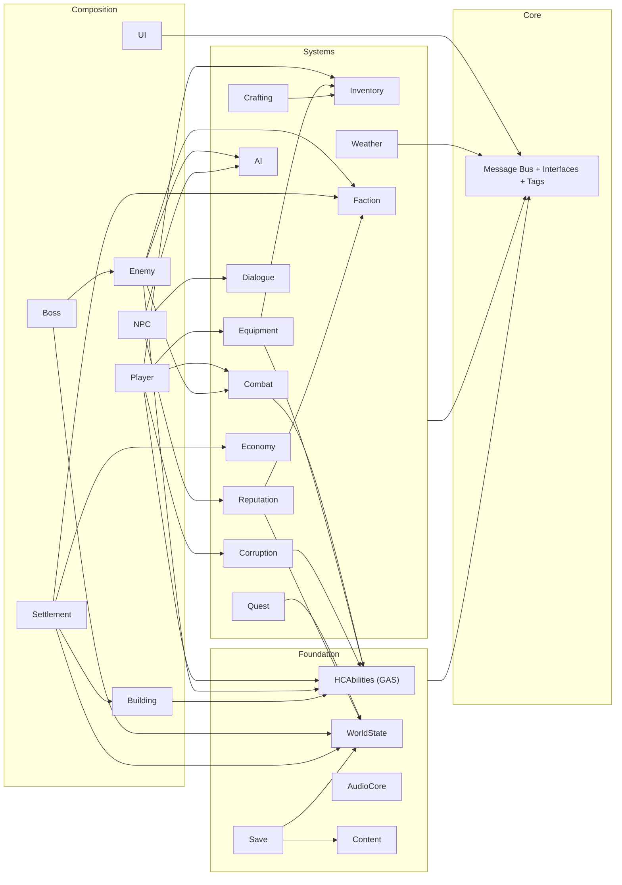
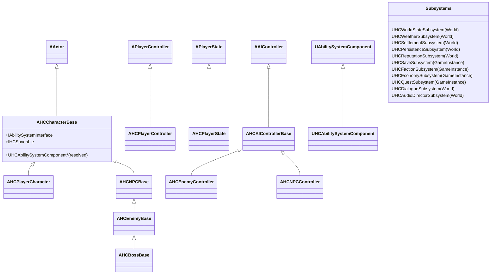
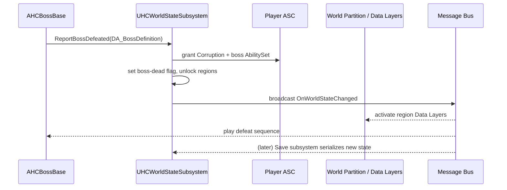
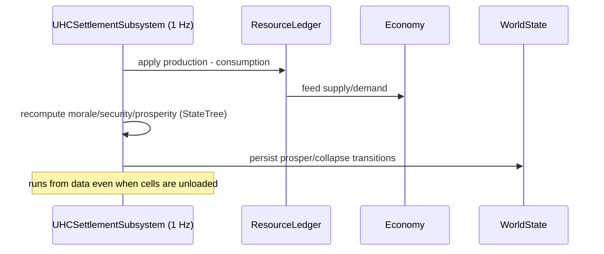
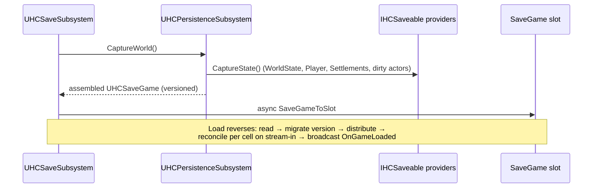

# The Hollow Crown — Technical Architecture (Master Specification)

> **Status:** Authoritative technical design. **Engine:** Unreal Engine 5.6.
> **Audience:** Engineering, technical design, production.
> This document is the deep technical source of truth. [`Architecture.md`](Architecture.md)
> is the one-page orientation; this expands it to AAA production depth. It defines
> *structure, contracts, and boundaries only* — no gameplay content, quests, or lore.

It is organized as the ten requested deliverables, preceded by the principles and the
module topology that everything else depends on:

- [0. Principles](#0-principles)
- [1. Module & Plugin Topology](#1-module--plugin-topology)
- [2. Complete System Architecture](#2-complete-system-architecture) (all 23 systems)
- [3. Dependency Diagram](#3-dependency-diagram)
- [4. Folder Structure](#4-folder-structure)
- [5. Class Hierarchy](#5-class-hierarchy)
- [6. Data-Flow Diagrams](#6-data-flow-diagrams)
- [7. Event System Architecture](#7-event-system-architecture)
- [8. Save Architecture](#8-save-architecture)
- [9. Performance Strategy](#9-performance-strategy)
- [10. Scalability Strategy](#10-scalability-strategy)
- [11. Multiplayer-Readiness Strategy](#11-multiplayer-readiness-strategy)
- [12. Development Roadmap](#12-development-roadmap)
- [Appendix A — Coding Standards & Anti-Patterns](#appendix-a--coding-standards--anti-patterns)

---

## 0. Principles

The five project pillars, made operational as engineering rules:

| # | Principle | Engineering rule it becomes |
|---|-----------|------------------------------|
| 1 | **Modular systems** | Each system is a UE **plugin/module** with a public API and no lateral hard references. Cross-system talk goes through Core interfaces, the message bus, or the World-State subsystem. |
| 2 | **Data-driven** | Behaviour is tuned in **Primary Data Assets** and **Data Tables** loaded via the **Asset Manager**. C++ ships *mechanisms*; designers ship *content*. Zero magic numbers in logic. |
| 3 | **Extensibility** | New content is a new data asset; new behaviour is a new component/ability/StateTree, never a branch in an existing class. Open for extension, closed for modification. |
| 4 | **Performance first** | Budgets are defined before code (§9). Crowds use **Mass**; significance drives tick/anim LOD; streaming is **World Partition** + Data Layers + HLOD from day one. |
| 5 | **Designer-friendly** | Every mechanism exposes `BlueprintCallable` / `BlueprintImplementableEvent` / assignable delegates and is authored against data assets in-editor. |

**Four cross-cutting tenets**

- **Composition over inheritance.** Actors are thin shells that assemble `UActorComponent`s. Inheritance is reserved for genuine *is-a* (e.g. `Enemy` *is-a* `Character`).
- **GAS is the gameplay backbone.** Anything that is a stat, a timed effect, a cooldown, a buff/debuff, or an activatable power is modelled in the **Gameplay Ability System**. This unifies combat, corruption, survival, settlement buffs, and boss powers under one replicated, data-driven system.
- **Subsystems for services.** World-spanning services are `UWorldSubsystem` / `UGameInstanceSubsystem` — discoverable, lifetime-managed, no singletons.
- **Event-driven decoupling.** Systems **broadcast** facts and **subscribe** to them through a typed message bus and gameplay tags; they do not call each other directly.

---

## 1. Module & Plugin Topology

The single biggest lever for "stays clean at scale" and "DLC-ready" is **compiling the
game as a set of Game Feature Plugins layered by dependency**, not one monolithic module.
Dependencies point **downward only**.

```mermaid
graph TD
  subgraph L4["Layer 4 — Composition & Game Features"]
    GF_Player["HCPlayer"]:::feat
    GF_Enemy["HCEnemy / HCBoss"]:::feat
    GF_Settle["HCSettlement"]:::feat
    GF_Build["HCBuilding"]:::feat
    GF_UI["HCUI"]:::feat
    GF_Region["HCRegion_* (DLC)"]:::dlc
  end
  subgraph L3["Layer 3 — Gameplay Systems"]
    Combat["HCCombat (GAS)"]
    Inv["HCInventory"]
    Equip["HCEquipment"]
    Craft["HCCrafting"]
    AI["HCAI"]
    Weather["HCWeather"]
    Dialogue["HCDialogue"]
    Quest["HCQuest"]
    Faction["HCFaction"]
    Econ["HCEconomy"]
    Corrupt["HCCorruption"]
  end
  subgraph L2["Layer 2 — Foundation Services"]
    GASCore["HCAbilities (AttributeSets, base GE/GA)"]
    WorldState["HCWorldState"]
    Save["HCPersistence/Save"]
    AudioCore["HCAudioCore"]
    AssetReg["HCContent (Asset Manager types)"]
  end
  subgraph L1["Layer 1 — Core"]
    Core["HCCore: types, GameplayTags, interfaces, message bus, dev tools"]
  end
  subgraph L0["Layer 0 — Engine & Plugins"]
    Engine["GAS · Mass · StateTree · SmartObjects · WorldPartition · Niagara · MetaSounds · EnhancedInput · Chaos · MotionMatching"]
  end

  L4 --> L3 --> L2 --> L1 --> L0
  classDef feat fill:#26333a,stroke:#5b7;
  classDef dlc fill:#3a2630,stroke:#b57,stroke-dasharray:4 3;
```



**Rules of the topology**

- A module may depend only on modules in a **lower** layer, never sideways or upward.
- Two Layer-3 systems that must interact do so through a **Layer-1/2 contract**: a Core interface, the message bus, or the World-State subsystem.
- **Game Feature Plugins** (Layer 4) can be *activated/deactivated at runtime* and added by DLC. A new region (`HCRegion_Blackwood`) ships as a Game Feature plugin that injects its actors, data, and Data Layers without touching shipped code. This is the formal DLC mechanism.
- The Asset Manager (`HCContent`) declares every **Primary Asset Type**; DLC plugins register additional assets of those types, so the rest of the game discovers them automatically.

---

## 2. Complete System Architecture

Each system below follows one template: **Responsibility · Key types · Data · Talks to (in/out) · Designer surface · Scaling note.** All C++ types use the `HC` prefix after the Unreal type prefix.

### 2.1 Player Framework

- **Responsibility:** Assemble the player avatar and route input to intent; own the player-side ASC.
- **Key types:**
  - `AHCPlayerCharacter` (`AHCCharacterBase`) — visual/physical shell; holds components, no rules.
  - `AHCPlayerController` — Enhanced Input → intent; UI ownership; possession.
  - `AHCPlayerState` — **owns the player `UHCAbilitySystemComponent` + AttributeSets** (persists across pawn respawn; correct for future multiplayer).
  - `AHCPlayerCameraManager` — combat/lock-on framing, corruption post-process hooks.
  - Components: `UHCInventoryComponent`, `UHCEquipmentComponent`, `UHCInteractionComponent`, `UHCQuestLogComponent`, `UHCCorruptionComponent` (facade over the Corruption attribute), `UHCCombatComponent`, `UHCTargetingComponent`.
- **Data:** `DA_PlayerLoadout`, default ability set (`UHCAbilitySet`), input config (`DA_InputConfig`).
- **Talks to:** *in* — Enhanced Input, interaction traces; *out* — broadcasts intent as Gameplay Events into the ASC; never implements combat math itself.
- **Designer surface:** `BP_PlayerCharacter` sets meshes, component data assets, default ability set, camera curves.
- **Scaling note:** ASC on PlayerState (Mixed replication) means the player framework is already multiplayer-correct.

**Player data flow:** `EnhancedInput → PlayerController → (intent) → Character → SendGameplayEvent → ASC → Ability activates → GameplayEffect → AttributeSet → GameplayCue (VFX/SFX) + Message (HUD)`.

### 2.2 Combat Framework

- **Responsibility:** Resolve melee now; ranged/magic later — all through GAS so the resolution path is identical regardless of source.
- **Key types (all `UActorComponent` unless noted):**
  - `UHCCombatComponent` — orchestrates attack intent, combo windows, weapon trace lifetime; *requests* abilities, doesn't compute damage.
  - `UHCHealthComponent` / `UHCStaminaComponent` — **thin facades** that read GAS attributes and broadcast change events for UI/AI; they do **not** store the authoritative value (the AttributeSet does).
  - `UHCDamageComponent` — wraps damage application as `UHCDamageExecution` (GAS `ExecutionCalculation`): armour, poise, weakness, corruption modifiers.
  - `UHCTargetingComponent` — lock-on, soft-target acquisition, EQS-assisted target scoring.
  - `UHCHitReactionComponent` — consumes hit-result Gameplay Events → selects montage/Niagara via tags; drives stagger/execution states.
- **Talks to:** *in* — Gameplay Events from weapon `AnimNotifyState` traces; *out* — `OnDamaged`, `OnDeath`, `OnStaggered` messages.
- **Designer surface:** weapon movesets are `DA_WeaponDefinition` (montages, costs, poise, ability granted); hit reactions are tag-driven montage tables.
- **Scaling note:** because damage is a `GameplayEffect` + `Execution`, a new damage type (fire, holy, corruption) is a new GE/tag — never a new branch.

**Communication:** combat components never reference each other. A swing's active window fires a `GameplayEvent.Montage.Hit`; the ASC runs the damage ability; the target's ASC applies the effect; attribute change → Health facade broadcasts → HUD/AI react. Decoupled end to end.

### 2.3 Gameplay Ability System (the backbone)

- **AttributeSets** (one per concern, all replicated):
  - `UHCHealthSet` (Health, MaxHealth, HealthRegen, Poise, MaxPoise)
  - `UHCStaminaSet` (Stamina, MaxStamina, StaminaRegen)
  - `UHCOffenseSet` (AttackPower, several damage-type scalars, CritChance)
  - `UHCDefenseSet` (Armor, per-type resistances, PoiseResist)
  - `UHCSurvivalSet` (Satiation, Rest, Warmth, Disease, Injury)
  - `UHCCorruptionSet` (Corruption, CorruptionStage as a tag-derived value)
- **Abilities (`UHCGameplayAbility`):** light/heavy/charged/dodge/parry/execution; corruption powers; consumables; settlement-granted passives. Activation gated by **Gameplay Tags** (`State.Staggered` blocks attacks; `Ability.Corruption.*` requires `Corruption.Stage.>=N`).
- **Effects (`GameplayEffect`):** instant (damage/heal), duration (buffs/debuffs/diseases), infinite (equipment & settlement passives). Cooldowns are GEs granting a cooldown tag; the ability blocks on that tag.
- **Cues (`GameplayCue`):** all transient feedback (impact Niagara, MetaSound, camera shake, decals) keyed by tag — net-efficient and reusable.
- **Ability Sets (`UHCAbilitySet`):** data assets that grant a bundle of abilities + attributes + startup effects. Equipment, corruption stages, and settlement buffs all **grant/revoke ability sets**, which is how those systems "add power" without coupling.

```
Boss power, corruption power, settlement buff, consumable, weapon art
      ↓ all are ↓
GameplayAbility (+ GameplayEffect + GameplayCue), granted via an AbilitySet
      ↓
one ASC, one replicated, predictable, data-driven resolution path
```

### 2.4 Inventory System

- **Key types:** `UHCInventoryComponent` (owns an array of `FHCItemStack`), `UHCItemDefinition : UPrimaryDataAsset` (immutable item data), `FHCItemInstance` (mutable per-instance state: durability, rolled mods, GUID).
- **Stacking:** stackable items merge to `MaxStackSize`; non-stackable (weapons/armor with instance state) never merge. The component exposes `AddItem/RemoveItem/QueryCount/HasItems` and broadcasts `OnInventoryChanged`.
- **Identity:** every non-stackable instance carries a **GUID** so equipment, save, and crafting reference the *same* item unambiguously.
- **Data:** items are **Primary Data Assets** (Asset-Manager-managed, soft-referenced icons/meshes) → DLC items appear automatically; UI never hard-loads meshes.
- **Save integration:** the component implements `IHCSaveable`; `CaptureState` writes `{definitionPrimaryAssetId, count, instanceState}` records — *not* object pointers — so saves survive code/content changes (see §8).
- **UI:** `WBP_Inventory` binds to `OnInventoryChanged`; pure view, no logic.

### 2.5 Equipment System

- **Key types:** `UHCEquipmentComponent` with a **data-driven slot table** (`DA_EquipmentLayout`): MainHand, OffHand, Head, Chest, Legs, Accessory×N — *slots are data, not enum branches*, so new slots are additive.
- **Mechanism:** equipping an item **grants its `UHCAbilitySet`** (stat GEs + weapon abilities + linked anim layer) to the owner's ASC; unequipping revokes it. Visuals attach via `DA_AttachmentSpec` (socket, mesh, anim layer).
- **Talks to:** Inventory (source), GAS (grant/revoke), Animation (linked anim layers per weapon class).
- **Designer surface:** an item becomes equippable purely by referencing a slot tag and an ability set in its definition.
- **Scaling note:** "future expansion slots" cost one row in the layout asset.

### 2.6 Crafting System

- **Key types:** `UHCCraftingSubsystem` (validation/execution), `FHCCraftingRecipe : FTableRowBase` (inputs → outputs, required station tag, required unlock).
- **Flow:** UI requests craft → subsystem checks inventory + station tag (from the building the player stands near) + recipe unlock (World-State flag) → consumes inputs, produces outputs via Inventory.
- **Data:** recipes in Data Tables grouped by discipline; unlock gated by tags so progression/DLC can add recipes.
- **Scaling note:** stations are just **Gameplay Tags** provided by buildings; a new station is a tag + a recipe filter.

### 2.7 Building System

- **Key types:** `UHCBuildSubsystem` (placement session, validation, commit), `AHCBuildingPiece` (placed structure, holds `UHCStructureComponent`), `AHCBuildingPreview` (ghost), `UHCStructureComponent` (health, repair, integrity, GAS-backed via a tiny `UHCStructureSet`).
- **Placement:** strategy objects — `Snap` (socket graph between pieces), `Grid` (quantized), `Free` (surface-projected) — selected per piece definition. Validation: collision, support/integrity, terrain slope, settlement bounds.
- **Damage/Repair:** structures are GAS targets (reuse the damage pipeline); destruction uses **Chaos Geometry Collections** triggered on death.
- **Data:** `DA_BuildingPieceDefinition` (mesh, sockets, cost, placement strategy, upgrade path, station tags provided, prosperity value).
- **Save:** placed pieces are persistent actors (OFPA) recorded by the persistence system (§8).
- **Scaling note:** thousands of placed pieces → HLOD + Mass-free static instancing; far settlements collapse to an HLOD proxy + a data summary.

### 2.8 Settlement System

- **Responsibility:** Simulate a settlement as an autonomous economy independent of whether the player is present or the cells are loaded.
- **Key types:** `UHCSettlementSubsystem` (registry of settlements), `FHCSettlementState` (population, food, morale, security, prosperity, stockpiles), `UHCResourceLedger` (sources/sinks per tick), `UHCCitizenManager` (binds residents to homes/jobs), `UHCSettlementDirector` (a **StateTree** "settlement AI" that reacts: grow, decay, request defenders, throw events).
- **Simulation:** runs on a **coarse fixed cadence** (e.g. 1 Hz) on the subsystem, *not* per-actor tick. When cells are unloaded the settlement still simulates from `FHCSettlementState` (a pure data model); when loaded, citizen actors are spawned/bound to reflect it.
- **Talks to:** Economy (prices/production), Faction/Reputation (who defends/attacks), Building (which structures exist → capabilities), World-State (prosper/collapse is a persistent fact), Weather (production modifiers).
- **Designer surface:** `DA_SettlementProfile` (caps, growth curves, building→capability mapping, event tables).
- **Scaling note:** O(settlements), not O(citizens) — the heavy loop is data; actors are a presentation layer spawned only when relevant.

### 2.9 NPC Framework

- **Responsibility:** Living named NPCs with schedules, needs, relationships, occupation, mood.
- **Key types:** `AHCNPCBase` (`AHCCharacterBase`), `AHCNPCController` (`AHCAIControllerBase`); components `UHCScheduleComponent`, `UHCNeedsComponent`, `UHCRelationshipComponent`, `UHCMoodComponent`, `UHCDialogueComponent`.
- **Brain:** a **StateTree** per NPC selects the high-level goal (sleep/eat/work/travel/flee/react); execution uses **Smart Objects** (a bed, a workbench, a market stall are Smart Objects the NPC claims) and the Navigation system.
- **Data:** `DA_NPCProfile` (identity, schedule template, occupation, personality weights, relationship seeds, dialogue graph ref).
- **Talks to:** Reputation/Corruption (fear & disposition modifiers feed mood and StateTree conditions), Weather (shelter behaviour), World-State (death/relocation persists), Dialogue.
- **Scaling note (critical):** see §9 — **named NPCs are actors with significance-based LOD; ambient crowds are Mass entities**, with promotion/demotion between the two as the player approaches.

### 2.10 Enemy Framework

- **Key types:** `AHCEnemyBase` (`AHCCharacterBase`), `AHCEnemyController` (`AHCAIControllerBase`), `UHCEnemySpawnerComponent`/`AHCEnemySpawnVolume`, `UHCEncounterSubsystem` (budgeted spawning & group coordination), `DA_EnemyArchetype` (stats, ability set, perception profile, loot table, group role).
- **Behaviour:** StateTree brain (patrol → investigate → combat → flee/regroup); **AI Perception** (sight/hearing/damage); **EQS** for positioning, flanking, cover. Group behaviour via a lightweight `UHCSquadComponent` shared blackboard/coordinator.
- **Talks to:** Combat/GAS (it *is* a GAS actor; same damage pipeline as the player), Faction (hostility), World-State (population thinning persists optionally).
- **Scaling note:** 50+ enemy types = 50+ `DA_EnemyArchetype` rows over a handful of C++ classes; behaviour differences live in StateTrees + ability sets, not subclasses.

### 2.11 Boss Framework

- **Key types:** `AHCBossBase : AHCEnemyBase`, `UHCBossPhaseComponent` (phase StateTree + transition rules), `AHCBossArena` (trigger, bounds, fog wall, camera, music state), `DA_BossDefinition` (phases, ability sets per phase, arena ref, **the four death guarantees**: world-state id, granted ability set, corruption reward, regions to unlock, reward loot).
- **Mechanism:** phases swap ability sets and StateTrees; cutscenes via Level Sequences triggered by phase tags; unique mechanics are abilities/Niagara, not bespoke classes.
- **Death pipeline (the centerpiece):** `Boss death → BossBase reports DA_BossDefinition.WorldStateId to UHCWorldStateSubsystem → world-state grants ability set + corruption to player, sets boss-dead flag, unlocks regions, broadcasts OnWorldStateChanged → streaming/weather/NPCs/UI react.` Fully data-driven; see §6.
- **Designer surface:** a complete boss is one `DA_BossDefinition` + StateTrees + montages + arena; no engineering per boss after the framework exists.

### 2.12 Quest Framework *(structure only — no quest content)*

- **Key types:** `UHCQuestSubsystem` (active/known quests), `UHCQuestLogComponent` (player-side view), `UHCQuestDefinition : UPrimaryDataAsset` (graph of objectives), `UHCObjective` (condition + completion), `FHCQuestState` (per-quest progress).
- **Mechanism:** objectives **subscribe to message-bus events and World-State flags** (e.g. "boss X dead", "item Y delivered") rather than polling. State-variable driven, not scene-branch trees.
- **Talks to:** World-State (outcomes persist as flags), Dialogue (quest givers), UI (log).
- **Scaling note:** quests are pure data + condition objects; DLC quest packs are new data assets.

### 2.13 Dialogue Framework *(structure only)*

- **Key types:** `UHCDialogueSubsystem` (runtime), `UHCDialogueGraph : UPrimaryDataAsset` (nodes/choices/conditions), `UHCDialogueComponent` (per-NPC entry point), `WBP_Dialogue` (view).
- **Conditions/effects:** nodes gate on Gameplay Tags, World-State flags, Reputation, Corruption stage; effects fire message-bus events (start quest, set flag, open vendor).
- **Scaling note:** localization via string tables from day one; graphs are data and DLC-extensible.

### 2.14 Weather Framework

- **Key types:** `UHCWeatherSubsystem` (authoritative state machine), `UHCSeasonSubsystem` (long cadence), `AHCClimateZoneVolume` (regional overrides), `DA_WeatherProfile` / `DA_SeasonProfile` (fog/rain/wind params, gameplay modifiers, audio bank, Niagara system, sky/PP).
- **Mechanism:** subsystem owns current + target state, blends via a Material Parameter Collection + Niagara + Sky/ExponentialHeightFog; broadcasts `OnWeatherChanged`. **Blood Moon** is a weather state amplified by Corruption.
- **Talks to:** Survival (warmth), AI/NPC (shelter, Blood-Moon aggression), Audio (ambient bank), Corruption (Blood-Moon frequency), Combat (traction/visibility modifiers as GEs).
- **Scaling note:** one subsystem drives global state; climate zones are volumes; cost is constant, not per-actor.

### 2.15 World State Framework *(most important persistence hub)*

- **Responsibility:** The single authoritative, persistent record of **everything that permanently changed**: boss deaths, quest outcomes, destroyed/saved settlements, notable NPC deaths, corruption stage at key beats, faction standing snapshots, world events.
- **Key types:** `UHCWorldStateSubsystem` with namespaced stores: `TSet<FHCBossId> Defeated`, `TSet<FName> UnlockedRegions`, `TMap<FName,FHCFlag> Flags`, `TMap<FGuid,FHCActorFate> ActorFates`.
- **Contract:** every "the world changes" action routes through one of a few entry points (`ReportBossDefeated`, `SetFlag`, `RecordActorFate`, `UnlockRegion`) and the subsystem **broadcasts `OnWorldStateChanged`**. Nothing polls; everyone subscribes.
- **It is the spine the Save system serializes** and the thing Quests, Dialogue, Streaming, NPCs, and Endings read.

### 2.16 Corruption Framework *(fully independent)*

- **Key types:** `UHCCorruptionComponent` (player facade) over the `UHCCorruptionSet` GAS attribute; stages derived from data-driven thresholds expressed as Gameplay Tags (`Corruption.Stage.1..5`).
- **Effects of corruption, each via an existing system (no new coupling):**
  - *Power:* crossing a stage grants a corruption **ability set** (GAS).
  - *Mutations:* a **Material Parameter Collection** + mesh/anim-layer swaps driven by the stage tag.
  - *NPC reactions:* stage tag feeds the **Reputation/Disposition** input → NPC mood/StateTree.
  - *Weather:* stage raises Blood-Moon weighting in the Weather subsystem.
  - *Endings:* stage at key beats is written to **World-State** flags.
- **Independence:** every interaction is "broadcast a tag/attribute; others subscribe." Corruption can be removed wholesale without breaking those systems.

### 2.17 Save System

See §8 for the full architecture. Summary: a `UHCSaveSubsystem` (GameInstance) orchestrates a `UHCPersistenceSubsystem` (World) that walks `IHCSaveable` providers and World-Partition-aware actor records into a versioned, slot-based `UHCSaveGame`.

### 2.18 Audio Framework

- **Key types:** `UHCAudioDirectorSubsystem` (high-level state: exploration/combat/boss/settlement), MetaSound sources, `AHCAmbientZone` volumes, AudioModulation control buses, submix graph.
- **Mechanism:** combat/cue audio is **GameplayCue-driven** (tag → MetaSound); ambient zones crossfade by volume; weather/boss/settlement states set Modulation parameters (mix snapshots). MetaSounds parameterize by gameplay (corruption stage detunes the ambient bed, etc.).
- **Scaling note:** concurrency + virtualization budgets defined in §9; everything tag-routed so new content needs no audio code.

### 2.19 Animation Framework

- **Stack:** `ABP_*` Animation Blueprints with **Linked Anim Layers** per weapon class (equipment injects the layer); **Motion Matching** (Pose Search) for locomotion; **Control Rig** for foot/hand IK and look-at; **Montages + Motion Warping** for attacks/traversal; **Root Motion** for committed attacks (authoritative on server later).
- **Combat coupling:** weapon traces are `AnimNotifyState`s that send Gameplay Events into the ASC (the only bridge between animation and damage).
- **Scaling note:** **Animation Budget Allocator** + significance throttle off-screen/distant skeletal meshes; crowds use Mass + vertex-animation or reduced AnimBP tiers.

### 2.20 UI Framework

- **Stack:** **UMG + Common UI** for input-agnostic navigation (KB/mouse/gamepad first-class), a `UHCHUDLayoutWidget` driven by a `UHCUISubsystem` and the message bus. Layers: HUD, Inventory, Crafting, Settlement, Dialogue, Map, Quest Log, Boss bar, Pause.
- **Mechanism:** widgets are **pure views** that subscribe to messages/attribute-change delegates; no gameplay logic in UI. Input via Common UI action routing → works on all devices without per-widget branching.
- **Scaling note:** data-bound lists (items/recipes) virtualize; one HUD layout asset per context.

### 2.21 Faction Framework

- **Key types:** `UHCFactionSubsystem`, `DA_FactionDefinition` (id, default stances, home regions), `FHCStanceMatrix` (faction↔faction base relations).
- **Mechanism:** factions are data; an actor's faction is a tag/component; AI perception consults the subsystem for hostility. DLC adds factions as data.

### 2.22 Reputation Framework

- **Key types:** `UHCReputationSubsystem`, `FHCReputation` (player↔faction and player↔individual scalars), modifiers from Corruption stage and World-State events.
- **Mechanism:** reputation feeds AI disposition, dialogue gates, vendor prices, and settlement recruitment. Reads broadcast; writes go through the subsystem; snapshots persist in World-State.

### 2.23 Economy Framework

- **Key types:** `UHCEconomySubsystem`, `DA_ResourceType`, `DA_VendorProfile`, `FHCPriceModel` (supply/demand, reputation, scarcity).
- **Mechanism:** every resource has explicit **sources and sinks** (settlement production/consumption, vendors, crafting). The economy subsystem prices transactions; settlements feed it production/consumption each coarse tick.
- **Scaling note:** balancing lives entirely in data; inflation is tuned by sinks, not code.

---

## 3. Dependency Diagram

Allowed dependency directions (arrows = "depends on / may reference"). Lateral
gameplay-system communication is **only** via Core interfaces, the message bus, or the
World-State subsystem.



Cycles are structurally impossible: any two systems that "need each other" both depend
*down* onto Core/World-State, never on each other.

---

## 4. Folder Structure

**Source (per plugin/module, mirrored):**

```
HollowCrown.uproject
Plugins/
  HCCore/            Source/HCCore/{Public,Private}/{Types,Tags,Interfaces,Messaging,DevTools}
  HCAbilities/       AttributeSets/ Abilities/ Effects/ Cues/ AbilitySets/
  HCContent/         AssetManager/ PrimaryAssetTypes/
  HCWorldState/      ...
  HCPersistence/     Save/ Records/ Serializers/
  HCCombat/          Components/ Execution/ Targeting/ HitReaction/
  HCInventory/  HCEquipment/  HCCrafting/
  HCAI/              Controllers/ StateTrees/ SmartObjects/ Mass/ EQS/
  HCWeather/  HCDialogue/  HCQuest/  HCFaction/  HCReputation/  HCCorruption/  HCEconomy/
  HCAudioCore/  HCUI/
  GameFeatures/
    HCPlayer/  HCEnemy/  HCBoss/  HCSettlement/  HCBuilding/
    HCRegion_WeepingMoors/   (region as Game Feature)
    HCRegion_Blackwood/      (DLC pattern)
Source/HollowCrown/           thin primary game module (boot, target glue)
```

**Content (`Content/`):**

```
Content/
  Core/            Tags/ Input/ MPC_*/ DevMaps/
  Characters/      Player/ NPC/ Enemy/ Boss/   (Mesh, ABP_, AbilitySets)
  Abilities/       GA_/ GE_/ GC_/ AS_ (ability set assets)
  Items/           Weapons/ Armor/ Consumables/ Materials/   (DA_*)
  Building/        Pieces/ (DA_ + SM_)  Settlements/ (DA_SettlementProfile)
  AI/              StateTrees/ BT_/ BB_/ EQS_/ SmartObjects/
  World/           Weather/ (DA_) Regions/ (Data Layers, Level Instances)
  Audio/           MetaSounds/ Cues/ AmbientBanks/ Submixes/
  UI/              WBP_/ Styles/ StringTables/
  Maps/            L_Persistent + WorldPartition cells
```

Content type-prefixes: `BP_ WBP_ DA_ DT_ GA_ GE_ GC_ AS_ ST_ BT_ BB_ EQS_ L_ M_ MI_ MPC_ T_ SK_ SM_ AM_ NS_ MS_`.

---

## 5. Class Hierarchy



- **Player ASC lives on `AHCPlayerState`**; AI/enemy/boss ASC lives on the pawn. `AHCCharacterBase` implements `IAbilitySystemInterface` and resolves the correct ASC.
- Every persistent actor implements **`IHCSaveable`**; every system service is a **Subsystem**; every reusable behaviour is a **`UActorComponent`**. Inheritance depth is intentionally shallow.

---

## 6. Data-Flow Diagrams

**6.1 Damage / combat resolution**

```mermaid
sequenceDiagram
  participant Anim as Weapon AnimNotifyState (trace)
  participant ASC_A as Attacker ASC
  participant ASC_B as Target ASC
  participant Attr as Target AttributeSet
  participant Cue as GameplayCue
  participant Msg as Message Bus
  Anim->>ASC_A: SendGameplayEvent(Hit, HitResult)
  ASC_A->>ASC_B: Apply GE_Damage (via HCDamageExecution)
  ASC_B->>Attr: modify Health / Poise
  Attr-->>ASC_B: attribute changed
  ASC_B->>Cue: trigger GC_Impact (Niagara + MetaSound + shake)
  ASC_B->>Msg: publish OnDamaged / OnPoiseBroken
  Msg-->>Anim: HitReaction selects montage; HUD/AI update
```

**6.2 Boss death → world changes (the four guarantees)**



**6.3 Save / load** — see §8 sequence.

**6.4 Settlement coarse tick**



---

## 7. Event System Architecture

Three decoupling channels, each with a defined job — **never** direct cross-system calls:

| Channel | Use for | Example |
|---------|---------|---------|
| **Gameplay Message Subsystem** (typed pub/sub, Lyra-style `HCMessageSubsystem`) | One-to-many gameplay facts across systems/UI | `OnDamaged`, `OnWeatherChanged`, `OnInventoryChanged`, `OnSettlementCollapsed` |
| **Gameplay Tags + GAS events** | Ability gating, states, cues | `State.Staggered`, `Ability.Corruption.*`, `GameplayEvent.Montage.Hit` |
| **World-State subsystem** | Persistent, authoritative world facts | boss dead, region unlocked, choice flags |

Rules:
- Publishers don't know subscribers; payloads are `USTRUCT`s with stable fields.
- UI and audio are **subscribers only** — they never push gameplay.
- A fact that must survive a save is a **World-State** entry, not just a transient message.
- Local, owner-only notifications (a component telling its actor) may use plain multicast delegates; anything crossing a system boundary uses the bus.

---

## 8. Save Architecture

**Goals:** persist world, settlements, NPCs, quests, bosses, buildings, corruption;
survive content/code changes; be World-Partition-correct; be multiplayer-ready.

- **`UHCSaveSubsystem` (GameInstance):** slot management, async read/write, versioning, orchestration.
- **`UHCPersistenceSubsystem` (World):** the engine. Maintains a registry of `IHCSaveable` providers (subsystems + components) and a **GUID-keyed actor record store**.
- **`UHCSaveGame` (versioned):** header (version, timestamp, region, playtime) + sections: WorldState, Player, Settlements, ActorRecords, SubsystemBlobs.

**Identity & streaming-correctness (the hard part):**
- Every persistent actor has a **stable `FGuid`** (authored actors via OFPA identity; runtime-spawned via assigned GUID stored in its record).
- Saving captures **records** (`{PrimaryAssetId/class, transform, IHCSaveable payload}`), not live pointers.
- Loading is **deferred and cell-aware**: when World Partition streams a cell in, the persistence subsystem **reconciles** that cell's actors against records — destroyed actors stay destroyed, moved/modified actors restore their state, runtime-spawned actors respawn. Far/unloaded content persists purely as records and data models (settlements simulate from `FHCSettlementState`).



- **Versioning:** `SaveVersion` + per-section migration; unknown-newer is rejected gracefully.
- **Multiplayer-ready:** providers serialize **replicated authoritative state**; on a server the same capture runs server-side. Records are net-location-agnostic.

---

## 9. Performance Strategy

**Budget (per frame, target platform = mid-range PC / current-gen console, 60 FPS = 16.6 ms):**

| Subsystem | Budget |
|-----------|--------|
| Game thread total | ≤ 10 ms |
| AI (all) | ≤ 2.5 ms |
| Animation | ≤ 2.5 ms |
| Gameplay/GAS | ≤ 1.5 ms |
| Render thread | ≤ 12 ms |
| GPU | ≤ 16 ms |
| Memory (game) | hard budget per region; tracked via LLM tags |

**Techniques (chosen before content):**
- **Crowd vs hero split (the #1 scaling decision):** ambient/background population = **Mass Entity** (data-oriented, instanced, no per-actor tick); named/interactive NPCs = actors with **Significance Manager**-driven tick & anim LOD. **Promotion/demotion**: a Mass entity becomes a full actor when the player is near / it becomes relevant, and demotes back when not. This is what keeps 100+ NPCs affordable.
- **Streaming:** **World Partition** with runtime **Data Layers** (per region, per world-state variant), **HLOD** for distant geometry & settlements, **One File Per Actor** for parallel iteration and save identity. Regions are **Level Instances** / Game Feature plugins.
- **Tick discipline:** almost nothing ticks every frame. Subsystems run **coarse fixed cadences** (settlement 1 Hz, weather sub-Hz). Components are event-driven. `PrimaryActorTick` disabled by default.
- **Animation:** **Animation Budget Allocator**, URO (Update-Rate Optimization) by significance, Motion Matching DB sized per platform, skeletal LODs.
- **GAS:** prediction-friendly abilities; cue batching; avoid per-frame attribute polling (use change delegates).
- **Audio:** concurrency caps, virtualization, distance-based MetaSound culling.
- **Memory:** all heavy content **soft-referenced** via Asset Manager; nothing hard-loads meshes/audio; streaming pools sized per region; LLM/Insights in CI.
- **Always-on instrumentation:** Unreal Insights traces + a dev HUD (fps, thread ms, entity/draw counts) behind a flag; perf budgets enforced as automated gates.

---

## 10. Scalability Strategy

How the architecture stays clean at the stated scale:

| Pressure | Why it stays clean |
|----------|--------------------|
| **100+ NPCs** | Mass for crowds + significance LOD for heroes; settlement sim is O(settlements) not O(citizens). |
| **50+ enemy types** | 1 `DA_EnemyArchetype` per type over a few C++ classes; behaviour = StateTree + ability set, not subclasses. |
| **12 bosses** | 1 `DA_BossDefinition` + StateTrees + arena each; the four death guarantees are framework-handled. Zero new engineering per boss. |
| **Thousands of world objects** | OFPA + World Partition + HLOD + static instancing; persistence by record, not live actors. |
| **Large regions** | Regions are Data-Layered Game Features streamed independently; world-state variants are Data Layers. |
| **Complex AI** | StateTree + Smart Objects + EQS + Mass; shared brains, data-authored differences. |
| **Future DLC** | New **Game Feature plugin** + new Primary Data Assets registered with the Asset Manager; activated at runtime; touches no shipped code. |

The invariant that guarantees this: **content scales as data; behaviour scales as
composition; systems never gain knowledge of each other.** Growth adds rows and assets,
not branches.

---

## 11. Multiplayer-Readiness Strategy

Single-player first, but no decisions that would force a rewrite:

- **Authority model assumed server-authoritative** from day one: AttributeSets and abilities replicate (GAS handles this); the player ASC is on **PlayerState** (correct for clients).
- **Components own replicated state**; UI/audio derive from it — already true for SP.
- **Input as intent** (Enhanced Input → Gameplay Events) maps cleanly to client→server RPC + prediction; root-motion attacks designed to be server-validated.
- **Persistence captures authoritative state** and is net-location-agnostic (records, GUIDs), so save/load extends to dedicated-server hosting.
- **Subsystem split** (`GameInstance` vs `World`) already respects per-world vs per-session lifetime, which is the multiplayer boundary.
- **Deferred but not blocked:** matchmaking/session, replication graph tuning, and rollback specifics are out of scope now; nothing above precludes them.

---

## 12. Development Roadmap

Phased to de-risk the architecture early and reach the vertical slice, then scale.

| Phase | Focus | Exit criteria |
|-------|-------|---------------|
| **P0 — Skeleton & boundaries** | Plugin/module topology, Core (tags, message bus, interfaces, `IHCSaveable`), Asset Manager types, dev HUD/Insights. | Empty but layered project compiles; dependency rules enforced; CI perf gate runs. |
| **P1 — GAS & player core** | AttributeSets, ability sets, Enhanced Input, `AHCPlayerCharacter`/`PlayerState`, combat resolution (melee), targeting, hit reaction, animation core (Motion Matching + montages). | Player fights a GAS enemy; stamina/poise/stagger function; all via GAS. |
| **P2 — Foundation services** | World-State subsystem, Save/Persistence (record-based, WP-aware), Inventory/Equipment, Audio director, UI shell (Common UI). | Save/load round-trips world-state + inventory across a streamed region. |
| **P3 — World & AI** | World Partition + Data Layers + HLOD region, Weather subsystem, NPC framework (StateTree + Smart Objects + schedules/needs), Enemy framework + encounter budgeting, **Mass crowd + significance LOD**. | A region streams; named + crowd NPCs coexist within budget; weather drives behaviour. |
| **P4 — Boss & world change** | Boss framework, arena, phase StateTrees, the four death guarantees through World-State; Corruption framework end to end. | Defeating a boss changes the world, grants an ability set, advances corruption, unlocks a region — all data-driven. |
| **P5 — Settlement & economy** | Settlement subsystem (coarse sim), Building system (Chaos destruction), Crafting, Economy, Faction/Reputation. | A settlement simulates while unloaded, prospers/collapses, and persists. |
| **P6 — Vertical-slice hardening** | Quest/Dialogue frameworks wired to World-State, full UI suite, performance & memory pass to budget, save-version migration. | 60 FPS to budget on target HW; a self-contained slice exercises every system. |
| **P7 — Scale & DLC proof** | Second region as a **Game Feature plugin**, second boss as pure data, multiplayer-readiness audit. | Adding a region/boss requires no shipped-code changes; perf holds at scale. |

---

## Appendix A — Coding Standards & Anti-Patterns

**Standards**
- `HC` prefix after the Unreal type prefix; one public type per header where practical.
- C++ owns mechanisms and contracts; Blueprints own content and composition; designers never edit C++ to add content.
- Heavy assets are **always** soft references through the Asset Manager.
- Persistent actors implement `IHCSaveable`; services are subsystems; behaviours are components.

**Forbidden (these break the architecture)**
- A Layer-3 system directly `#include`-ing or hard-referencing another Layer-3 system.
- `Cast<>` to a concrete sibling system to call it — use an interface or the bus.
- Gameplay logic inside UI widgets or animation graphs (beyond the sanctioned AnimNotify→GAS bridge).
- Magic numbers in logic; per-frame attribute polling; default-on `PrimaryActorTick`.
- New subclasses to express content variation that data + composition can express.
- Writing a permanent world change anywhere except the World-State subsystem.
